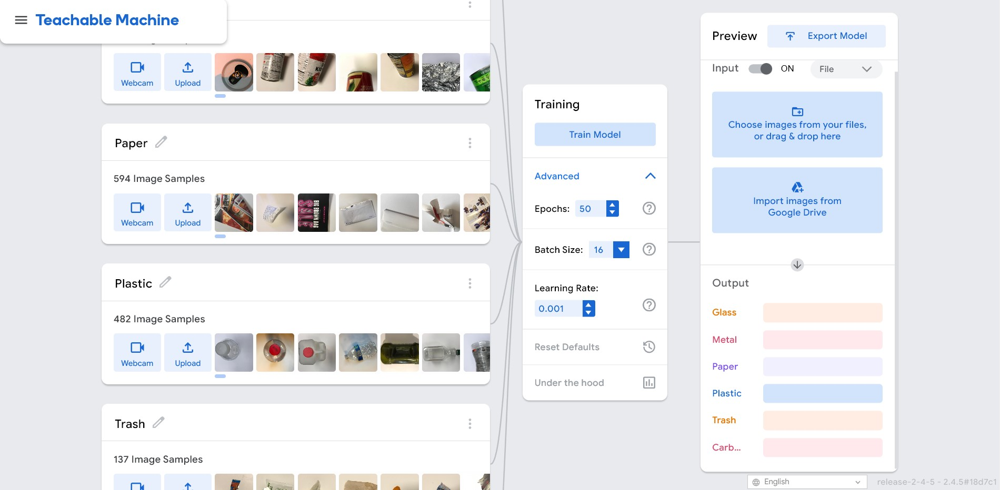
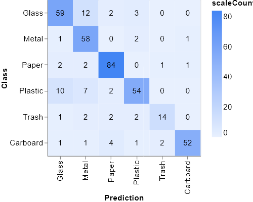
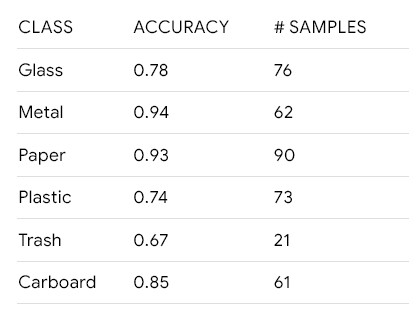
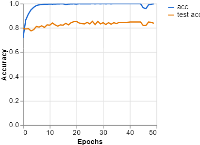
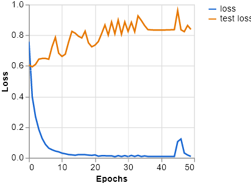

# BinSpy

## An AI Model for Accurate Sorting of Recyclable Items.

BinSpy is an advanced AI model built, trained, and exported on Teachable Machine. It is designed to accurately sort various recyclable items such as plastic bottles, cans, paper, and cardboard, among others. BinSpy utilizes state-of-the-art machine learning algorithms to analyze and classify different materials, ensuring proper sorting and disposal.

The AI model is easy to install and can be integrated with existing recycling systems, making the sorting process more efficient and effective. BinSpy is equipped with a user-friendly interface that allows recycling plant operators to monitor the sorting process in real-time. This helps to minimize contamination, reduce waste, and increase the recovery of valuable materials.


## ⭐  Model is developed on Teachable Machine

[Teachable Machine](https://teachablemachine.withgoogle.com/)



Teachable Machine is an innovative platform developed by Google that allows users to build custom machine learning models without the need for coding or extensive technical knowledge. The platform utilizes a simple drag-and-drop interface that allows users to input data and train machine learning models quickly and easily.

Teachable Machine has several features that make it an ideal tool for building custom machine learning models. Firstly, it allows users to train models using a variety of data types, such as images, sounds, and sensor data. Secondly, it provides users with the ability to choose from a range of pre-built machine learning models, such as image classification and sound recognition, or to build custom models from scratch.

BinSpy is an excellent example of a real-world application built using Teachable Machine. The project utilizes the image classification model in Teachable Machine to train an AI model that can accurately sort recyclable items. By using Teachable Machine, an AI model can be developed from scratch without the need for extensive technical knowledge or coding skills.


## ⭐  To run these scripts, you need the following installed:

1. Python 3
2. The python libraries listed in requirements.txt
    * Try running "pip3 install -r requirements.txt"

### Step 1: Clone this repository
Run:
```bash
git clone https://github.com/SaiJeevanPuchakayala/BinSpy
```

### Step 2: Navigate to the BinSpy directory
Run:
```bash
cd BinSpy
```
### Step 3: Install the python libraries
Run:
```bash
pip install -r requirements.txt
```
### Step 4: Run the streamlitApp.py file
Run:
```bash
streamlit run streamlitApp.py
```

## ⭐ Streamlit Deployment Configurations:
```
[theme]
base="dark"

[browser]
gatherUsageStats = false
```

## ⭐ Few images illustrating model performance

> Confusion Matrix

</b></b>

> Accuracy Per Class

</b></b>

> Accuracy Per Epoch

</b></b>

> Loss Per Epoch


## ⭐ References:
1. https://30days.streamlit.app/
2. https://docs.streamlit.io/streamlit-community-cloud/get-started/deploy-an-app
3. https://streamlit-cloud-example-apps-streamlit-app-sw3u0r.streamlit.app/?hsCtaTracking=28f10086-a3a5-4ea8-9403-f3d52bf26184|22470002-acb1-4d93-8286-00ee4f8a46fb
4. https://docs.streamlit.io/library/advanced-features/configuration